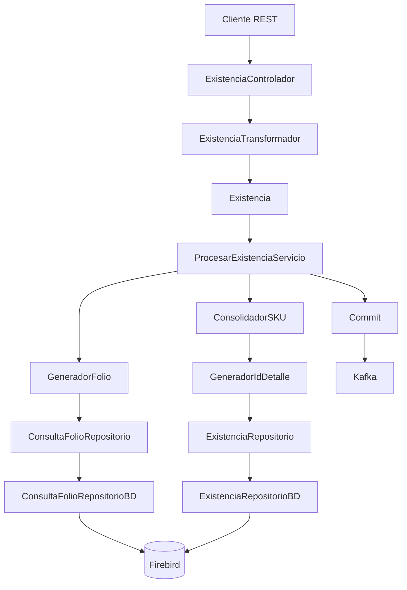
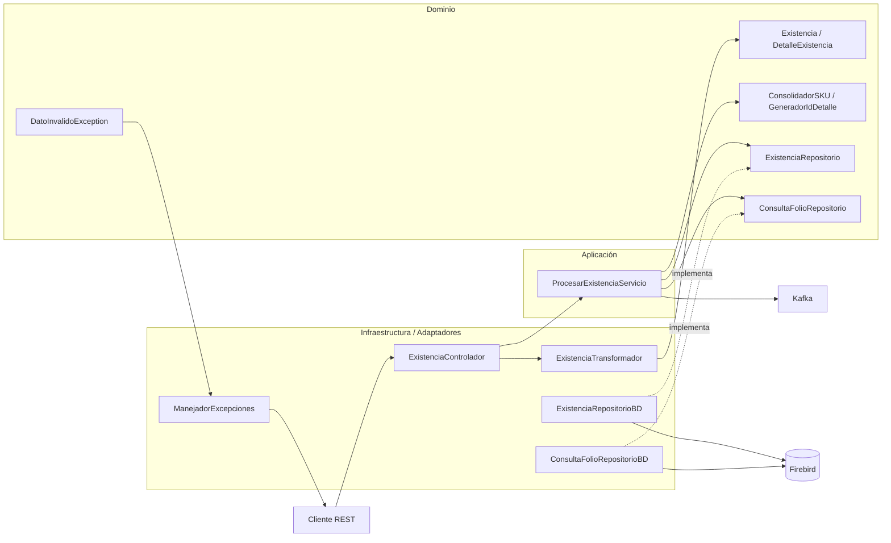
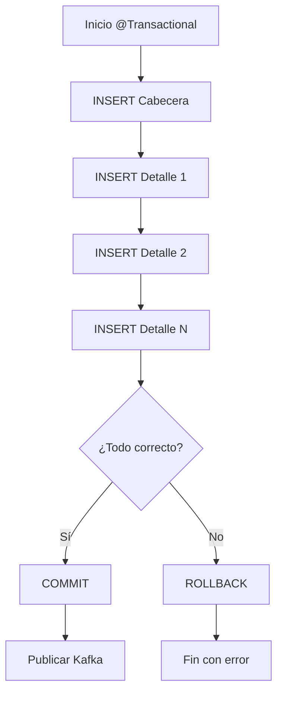

# OperacionInventario

## 1. Descripción

**OperacionInventario** es un microservicio REST para procesar operaciones de inventario.

El flujo principal recibe una solicitud, transforma los datos de entrada al modelo de dominio, genera el folio, consolida los SKU, genera los identificadores de detalle y persiste la cabecera y sus detalles en Firebird.

La solución sigue principios de **Arquitectura Hexagonal (Ports & Adapters)**, manteniendo el dominio independiente de la tecnología de persistencia y de los detalles de infraestructura.

### Diagrama arquitectónico de referencia para implementación

Este diagrama forma parte del diseño arquitectónico que define el Líder Técnico y proporciona a los programadores como guía de implementación. Su propósito es establecer claramente las capas, responsabilidades, puertos y adaptadores que deben respetarse durante el desarrollo.


```text
                    +---------------------+
                    |     CLIENTE REST    |
                    +----------+----------+
                               |
                               v
                    +---------------------+
                    |  INFRAESTRUCTURA    |
                    |                     |
                    | Controlador         |
                    | Transformador       |
                    | Exception Handler   |
                    +----------+----------+
                               |
                               v
                    +---------------------+
                    |     APLICACIÓN      |
                    |                     |
                    | ProcesarExistencia  |
                    |    @Transactional   |
                    +----------+----------+
                               |
                    +----------+----------+
                    |                     |
                    v                     v
          +-----------------+   +-----------------+
          |     DOMINIO     |   |     PUERTOS     |
          |                 |   |                 |
          | Existencia      |   | ExistenciaRepo  |
          | Detalle         |   | FolioRepo       |
          | ConsolidadorSKU |   +--------+--------+
          | GeneradorIdDet  |            |
          +-----------------+            v
                               +---------------------+
                               |     ADAPTADORES     |
                               |                     |
                               | ExistenciaRepoBD    |
                               | ConsultaFolioRepoBD |
                               +----------+----------+
                                          |
                                          v
                               +---------------------+
                               |      FIREBIRD       |
                               |                     |
                               | INV_O_EXISTENCIAS   |
                               | INV_O_EXIS_DET      |
                               +---------------------+
```

## 2. Características principales

- API REST con Spring Boot.
- Java 21.
- Arquitectura Hexagonal / Ports & Adapters.
- Separación entre dominio, aplicación e infraestructura.
- Persistencia mediante `JdbcTemplate`.
- Base de datos Firebird.
- Driver JDBC Jaybird 6.0.6.
- Pool de conexiones HikariCP.
- Generación de folios desde Java.
- Consulta del último folio mediante un puerto de persistencia.
- Consolidación de productos/SKU.
- Generación de `ID_DET`.
- Inserción de una cabecera y múltiples detalles.
- Transacciones mediante `@Transactional`.
- Rollback automático ante errores.
- Publicación hacia Kafka después del commit.
- Manejo centralizado de excepciones REST.
- Respuestas de error controladas sin exponer stack traces.
- Logging para diagnóstico interno.

---

## 3. Tecnologías

| Tecnología | Uso |
|---|---|
| Java 21 | Lenguaje |
| Spring Boot | Framework principal |
| Spring Web | API REST |
| Spring JDBC | Acceso mediante `JdbcTemplate` |
| JdbcTemplate | Ejecución de SQL |
| HikariCP | Pool de conexiones |
| Firebird | Base de datos |
| Jaybird 6.0.6 | Driver JDBC |
| Kafka | Mensajería después del commit |
| Maven | Gestión de dependencias |

Dependencias relevantes:

```xml
<dependency>
    <groupId>org.springframework.boot</groupId>
    <artifactId>spring-boot-starter-jdbc</artifactId>
</dependency>

<dependency>
    <groupId>org.firebirdsql.jdbc</groupId>
    <artifactId>jaybird</artifactId>
    <version>6.0.6</version>
</dependency>
```

> `spring-boot-starter-data-jdbc` no se utiliza. El proyecto trabaja directamente con `JdbcTemplate`.

---

## 4. Base de datos

### Cabecera: `INV_O_EXISTENCIAS`

Campos utilizados:

```text
ID_EMPLEADO
ID_SUCURSAL
FOLIO
FECHA_DOC
```

### Detalle: `INV_O_EXIS_DET`

Campos utilizados:

```text
ID_UN_MED
ID_SKU_CODIGO
ID_OBJ_ALM
FECHA_DOC
FOLIO
ID_DET
TIPO
CANTIDAD
```

Relación conceptual:

```text
INV_O_EXISTENCIAS
        1
        |
        | N
        v
INV_O_EXIS_DET
```

---

## 5. Modelo de dominio

### Existencia

```java
public class Existencia implements Serializable {

    private static final long serialVersionUID = 7605612050451854434L;

    private String Id_Empleado;
    private Integer Id_Sucursal;
    private LocalDateTime Fecha_Doc;
    private String Folio;
    private List<DetalleExistencia> DetalleDoc;
}
```

### DetalleExistencia

```java
public class DetalleExistencia implements Serializable {

    private static final long serialVersionUID = -5808974323605733728L;

    private Integer Id_Un_Medida;
    private String Id_SKU_Codigo;
    private Integer Id_Obj_Alm;
    private LocalDateTime FechaDoc;
    private String Folio;
    private Integer Id_Det;
    private Integer Tipo;
    private BigDecimal Cantidad;
}
```

---

## 6. Flujo funcional



---

## 7. Estructura del proyecto

```text
com.ope.inv
│
├── dominio
│   ├── ...
│   ├── servicio
│   │   ├── ConsolidadorSKU
│   │   └── GeneradorIdDetalle
│   │
│   ├── puerto
│   │   ├── ConsultaFolioRepositorio
│   │   └── ExistenciaRepositorio
│   │
│   └── excepciones
│       └── DatoInvalidoException.java
│
├── aplicacion
│   └── servicio
│       └── ProcesarExistenciaServicio.java
│
└── infraestructura
    ├── entrada
    │   └── ...
    │
    ├── persistencia
    │   ├── ConsultaFolioRepositorioBD.java
    │   └── ExistenciaRepositorioBD.java
    │
    └── excepciones
        ├── ErrorRespuesta.java
        └── ManejadorExcepciones.java
```

---

## 8. Responsabilidades

### Dominio

Contiene conceptos y reglas propias del negocio:

- `Existencia`
- `DetalleExistencia`
- `ConsolidadorSKU`
- `GeneradorIdDetalle`
- `DatoInvalidoException`

El dominio no debe depender de Firebird, JDBC, HTTP ni Kafka.

### Aplicación

`ProcesarExistenciaServicio` coordina el caso de uso:

```text
Recibir existencia
      ↓
Generar folio
      ↓
Consolidar SKU
      ↓
Generar ID_DET
      ↓
Completar información
      ↓
Guardar cabecera y detalles
      ↓
Commit
      ↓
Publicar Kafka
```

La transacción se controla mediante `@Transactional`.

### Infraestructura

Contiene los detalles tecnológicos:

- Controladores REST.
- Transformadores de entrada.
- JdbcTemplate.
- Firebird.
- Implementaciones de repositorios.
- Manejo HTTP.
- Configuración.
- Kafka.

---

# 9. Arquitectura Hexagonal



### Principio central

El servicio depende del **puerto**, no directamente de Firebird:

```text
ProcesarExistenciaServicio
          |
          v
ExistenciaRepositorio   <-- interfaz
          ^
          |
ExistenciaRepositorioBD <-- adapter
          |
          v
       Firebird
```

Por eso la base de datos puede cambiar sin modificar las reglas de negocio.

---

# 10. Puertos y adaptadores

## ExistenciaRepositorio

Puerto de salida:

```java
public interface ExistenciaRepositorio {

    void guardar(Existencia existencia);
}
```

La aplicación expresa:

> Necesito guardar una existencia.

No necesita conocer cómo se ejecuta el SQL.

## ExistenciaRepositorioBD

Adaptador de infraestructura:

```java
@Repository
public class ExistenciaRepositorioBD
        implements ExistenciaRepositorio {

    // JdbcTemplate
    // INSERT cabecera
    // INSERT detalles
}
```

Este adapter conoce SQL, JdbcTemplate, Firebird, tablas y columnas.

## ConsultaFolioRepositorio

Otro puerto de salida que permite consultar el último folio sin acoplar el dominio a Firebird.

Su implementación concreta es:

```text
ConsultaFolioRepositorioBD
```

---

# 11. Persistencia

La operación de guardado realiza:

```text
Existencia
    |
    +-- INSERT INV_O_EXISTENCIAS
    |
    +-- INSERT INV_O_EXIS_DET
          +-- Detalle 1
          +-- Detalle 2
          +-- Detalle 3
          +-- Detalle N
```

Cada detalle recibe la información necesaria de la cabecera, incluyendo:

```text
Folio
FechaDoc
```

---

# 12. Transacciones

La operación de negocio está protegida mediante `@Transactional`.



Si un detalle falla:

```text
Cabecera       ✓
Detalle 1      ✓
Detalle 2      ✗
       ↓
    ROLLBACK
       ↓
No queda información parcial
```

El código de persistencia no realiza manualmente `commit()` ni `rollback()`; Spring administra la transacción.

---

# 13. Generación de folio

El folio se genera desde Java:

```text
GeneradorFolio
      ↓
ConsultaFolioRepositorio
      ↓
ConsultaFolioRepositorioBD
      ↓
Firebird
      ↓
Último folio
      ↓
Calcular consecutivo
      ↓
Generar nuevo folio
```

La implementación concreta de base de datos permanece en infraestructura.

---

# 14. Consolidación de SKU

Antes de persistir los detalles se realiza la consolidación.

Ejemplo:

```text
Entrada:

SKU A → 10
SKU B → 5
SKU A → 7
SKU C → 3

        ↓

Resultado:

SKU A → 17
SKU B → 5
SKU C → 3
```

Principio utilizado durante el desarrollo:

> **"Si ya lo contabilicé (lo vi), ¿por qué tendría que volver a calcularlo si ya lo tengo?"**

Las estructuras de búsqueda como `Map` pueden utilizarse cuando permiten evitar recorridos repetidos.

---

# 15. Manejo de excepciones

## Excepción de dominio

Paquete:

```text
com.ope.inv.dominio.excepciones
```

Clase:

```text
DatoInvalidoException
```

Ejemplo:

```java
throw new DatoInvalidoException(
    "Tipo de movimiento no válido: " + tipo
);
```

Esta excepción no conoce HTTP.

## Manejo HTTP

Paquete:

```text
com.ope.inv.infraestructura.excepciones
```

Clases:

```text
ErrorRespuesta
ManejadorExcepciones
```

`ManejadorExcepciones` utiliza:

```java
@RestControllerAdvice
```

para centralizar las excepciones REST.

---

# 16. Respuestas de error

### JSON inválido

Cuando Jackson no puede convertir un dato:

```text
HttpMessageNotReadableException
```

La API devuelve:

```json
{
    "codigo": "JSON_INVALIDO",
    "mensaje": "El formato de los datos enviados no es válido"
}
```

HTTP:

```text
400 Bad Request
```

### Dato inválido

Cuando una regla propia detecta un dato incorrecto:

```json
{
    "codigo": "DATO_INVALIDO",
    "mensaje": "Tipo de movimiento no válido: -"
}
```

HTTP:

```text
400 Bad Request
```

---

# 17. Stack trace

El stack trace no forma parte de la respuesta pública de la API.

```text
                 Error
                   |
          +--------+--------+
          |                 |
          v                 v
       Cliente             Logs
          |                 |
    JSON controlado    Stack trace
```

El consumidor recibe información controlada.

Los logs internos conservan información técnica para diagnóstico.

---

# 18. Configuración Firebird

```properties
spring.datasource.driver-class-name=org.firebirdsql.jdbc.FBDriver

spring.datasource.url=jdbc:firebird://localhost:3050/C:/Aplicativos/BDFirebird/OPERACIONGENERAL.FDB

spring.datasource.username=USROPE
spring.datasource.password=Ejecutor

spring.datasource.hikari.connection-test-query=SELECT 1 FROM RDB$DATABASE

spring.sql.init.mode=never
```

---

# 19. Logging

Configuración principal:

```properties
logging.level.root=INFO
logging.level.com.ope.inv=DEBUG
```

- Esto permite observar el flujo del microservicio durante desarrollo y diagnóstico.
- Adicional crea mediante el archivo xml de configuracion 2 archivos, uno ```app-info.log``` donde registra los sucesos y otro ```app-error.log``` donde registra errores de excepcion que suceda en el MicroServicio.
- Una configuracion en los logs es la rotativa que con llevan, despues de 10 MB de capaciadad crea otro archivo con el siguiente formato ```dd-MM-yyyy```.

---

# 20. Decisiones de diseño

### Dominio independiente de la base de datos

El cambio de Oracle a Firebird no requirió modificar las reglas de negocio. La adaptación se realizó en infraestructura.

### Uso de JdbcTemplate

Se utiliza SQL directo mediante `JdbcTemplate` para controlar explícitamente las consultas e inserciones.

### Sin lógica de negocio en SQL

La generación del folio, consolidación y reglas de negocio permanecen en Java.

### Transacciones administradas por Spring

Se utiliza `@Transactional` para asegurar atomicidad.

### Kafka después del commit

La publicación hacia Kafka se plantea después de completar correctamente la persistencia.

### Excepciones separadas por responsabilidad

Las excepciones del negocio no conocen HTTP. La infraestructura transforma esas excepciones en respuestas REST.

---

## Impacto de SOLID en la arquitectura

Los principios **SOLID** sirven como criterio de diseño para mantener `OperacionInventario` desacoplado, mantenible y fácil de extender. En este proyecto no se aplican como teoría aislada: se reflejan principalmente en la separación entre dominio, aplicación e infraestructura, en el uso de puertos y adaptadores y en la responsabilidad específica de cada componente.

### S — Single Responsibility Principle (Responsabilidad Única)

Cada clase debe tener una razón principal para cambiar. En el proyecto se refleja en `ExistenciaTransformador` (transformación), `ProcesarExistenciaServicio` (caso de uso), `GeneradorFolio` (folio), `ConsolidadorSKU` (regla de consolidación), `GeneradorIdDetalle` (identificadores), `ExistenciaRepositorioBD` (persistencia) y `ManejadorExcepciones` (respuesta HTTP). Esto evita clases que concentren transformación, negocio, persistencia y HTTP.

### O — Open/Closed Principle (Abierto/Cerrado)

Los componentes deben poder extenderse sin modificar innecesariamente el código existente. `ProcesarExistenciaServicio` depende de `ExistenciaRepositorio`, no de `ExistenciaRepositorioBD`; por ello se puede incorporar otro adaptador de persistencia sin cambiar el caso de uso.

### L — Liskov Substitution Principle (Sustitución de Liskov)

Una implementación de un puerto debe poder sustituirse por otra respetando su contrato. Un repositorio Firebird y una futura implementación para Oracle pueden sustituirse desde el punto de vista de `ProcesarExistenciaServicio`, siempre que cumplan el contrato de `ExistenciaRepositorio`.

### I — Interface Segregation Principle (Segregación de Interfaces)

Las interfaces deben ser pequeñas y enfocadas. `ConsultaFolioRepositorio` y `ExistenciaRepositorio` representan capacidades concretas, evitando una interfaz enorme con operaciones no relacionadas.

### D — Dependency Inversion Principle (Inversión de Dependencias)

Los componentes de alto nivel dependen de abstracciones y no de detalles tecnológicos. `ProcesarExistenciaServicio` depende de `ExistenciaRepositorio`, mientras `ExistenciaRepositorioBD` conoce `JdbcTemplate` y Firebird. `GeneradorFolio` depende de `ConsultaFolioRepositorio`, mientras `ConsultaFolioRepositorioBD` contiene el detalle de acceso a la base de datos.

### SOLID y el cambio de Oracle a Firebird

La migración de Oracle a Firebird demuestra el valor del desacoplamiento: el dominio y la aplicación permanecen independientes de la base de datos y el cambio se concentra principalmente en infraestructura y configuración.

```text
                 DOMINIO
                    |
                 APLICACIÓN
                    |
                  PUERTOS
                    |
          +---------+---------+
          |                   |
     Adaptador Oracle    Adaptador Firebird
          |                   |
       Oracle             JdbcTemplate
                              |
                           Firebird
```

### SOLID como criterio para el Líder Técnico

SOLID no significa crear interfaces o clases por obligación. En este proyecto debe utilizarse para mantener responsabilidades claras, dependencias invertidas, puertos pequeños y adaptadores sustituibles, evitando abstracciones innecesarias. En conjunto, **SOLID refuerza la arquitectura hexagonal** y ayuda a que las reglas de negocio permanezcan independientes de HTTP, Firebird, `JdbcTemplate`, controladores y otros detalles externos.

---

# 21. Estado actual

Al cierre de esta etapa:

- La aplicación inicia correctamente.
- Spring Boot levanta el servicio REST.
- Firebird está configurado.
- HikariCP establece conexiones.
- `JdbcTemplate` ejecuta consultas e inserciones.
- Se obtiene el último folio desde Firebird.
- Se genera el nuevo folio.
- Se consolidan los SKU.
- Se generan los identificadores de detalle.
- Se inserta la cabecera.
- Se insertan los detalles.
- La operación está protegida por transacción.
- Se implementó manejo global de excepciones.
- Los errores REST tienen un formato controlado.
- El stack trace no se expone al consumidor.
- Kafka queda contemplado para publicación posterior al commit.

---

## Conclusión

OperacionInventario queda estructurado para que las reglas de negocio estén separadas de los mecanismos técnicos.

La idea central de la arquitectura es:

> **El dominio define qué necesita la aplicación; los puertos definen cómo se comunica con el exterior; los adaptadores implementan esas comunicaciones.**

Esto permite mantener la lógica de negocio estable aunque cambien tecnologías como la base de datos, el mecanismo de mensajería o componentes de infraestructura.


# OperacionInventario
